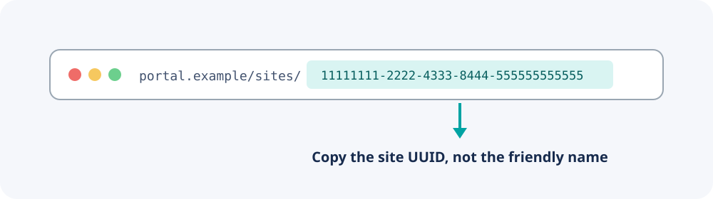

# Account and Site ID

Use a dedicated Instant On portal account instead of an owner's everyday
administrator account.

## Recommended account model

The account should:

- Have access only to the site or sites Home Assistant must monitor.
- Use a unique, randomly generated password.
- Not reuse a personal or infrastructure-administrator password.
- Be documented as a service account in your password manager.

The current automated portal authentication flow cannot complete an MFA
challenge. If organizational policy requires MFA for every portal account,
this integration cannot authenticate until that limitation is resolved.

## Find the site ID

1. Sign in to the Instant On web portal.
2. Open the site you want Home Assistant to monitor.
3. Look at the browser address bar.
4. Copy the UUID associated with the selected site.

The expected value resembles this fictional format:

```text
11111111-2222-4333-8444-555555555555
```

Do not use the friendly site name, account ID, device serial number, or Home
Assistant device ID.



## Multiple sites

Add the integration once for each site:

1. Use the same dedicated account if it has intentionally limited access to
   all required sites.
2. Enter a different site ID for every config entry.
3. Home Assistant prevents the same site ID from being configured twice.

For stronger isolation, use a separate portal account per site.

## Security notes

Home Assistant stores the account data in protected config-entry storage.
Do not place portal credentials in dashboard YAML, `secrets.yaml`, issue
reports, screenshots, or this repository.

If credentials may have been exposed, change the password immediately. Removing
the value from a later Git commit does not remove it from earlier history.

