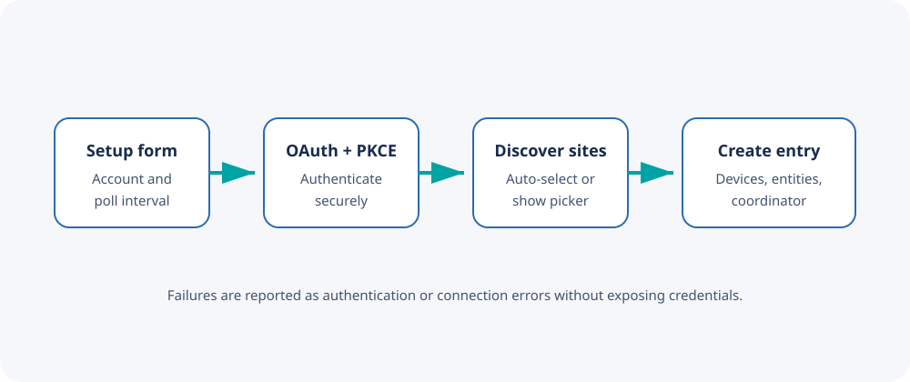

# Configuration

## Add the integration

1. Open **Settings → Devices & services**.
2. Select **Add integration**.
3. Search for **Aruba Instant On**.
4. Complete the setup form.

## Setup fields

| Field | Value |
| --- | --- |
| Email | Dedicated Instant On portal account |
| Password | Password for that dedicated account |
| Site ID | UUID from the portal URL |
| Polling interval | Refresh frequency in seconds |

The polling interval accepts values from 60 through 3600 seconds. Start with
300 seconds. A shorter interval creates more portal traffic and may increase
the risk of throttling without materially improving a network overview.

## What validation does

Before saving, the config flow:

1. Discovers the portal's current OAuth client configuration.
2. Attempts the OAuth authorization-code flow with PKCE.
3. Obtains a short-lived bearer token.
4. Requests the accessible-site list.
5. Confirms the supplied site ID is available to the account.
6. Creates the Home Assistant config entry.

The site UUID becomes the unique ID, so duplicate entries are rejected.

## Change the polling interval

1. Open **Settings → Devices & services**.
2. Select the configured Aruba Instant On entry.
3. Open **Configure**.
4. Enter a value from 60 to 3600 seconds.

Credential and site changes currently require removing and adding the config
entry again.

## Suggested polling intervals

| Use case | Interval |
| --- | ---: |
| Normal household or small office dashboard | 300 seconds |
| Slowly changing status display | 600–900 seconds |
| Short troubleshooting session | 60–120 seconds |
| Minimal portal traffic | 1800–3600 seconds |

## Successful setup

After setup, Home Assistant should show:

- One integration entry named after the site
- One parent device representing the site
- Child devices for access points and switches
- Site-level sensors
- Connectivity and uptime entities for infrastructure devices

Continue with [Entities](Entities.md) to understand the resulting model.

