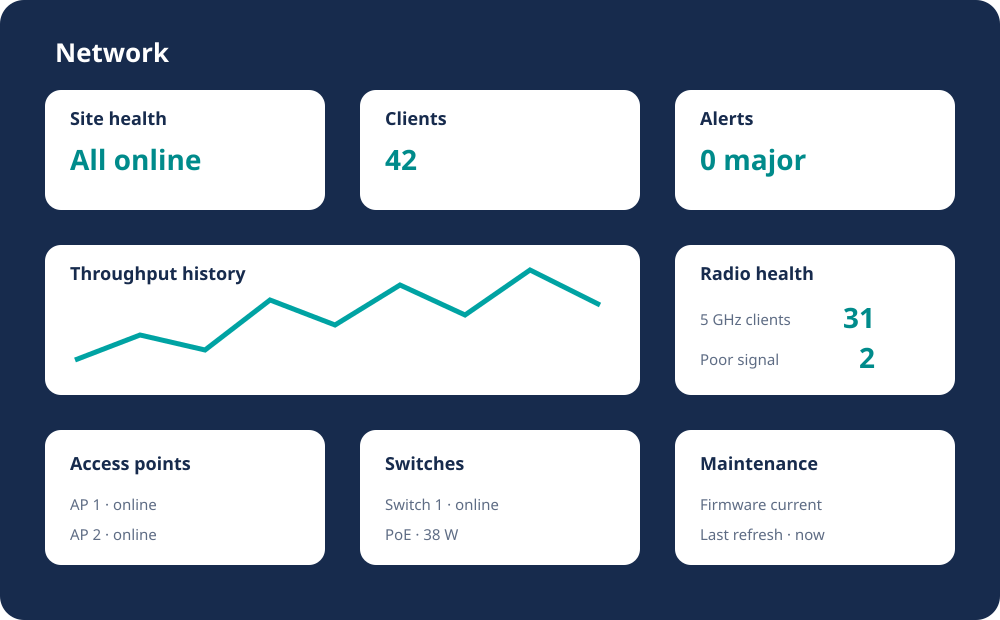

# Dashboard

The repository includes a reusable Aruba card group and a reference combined
network view:

- `dashboard/network-cards.json`
- `dashboard/network-view.yaml`

The cards use generic entity IDs. Replace them with the IDs created by your
Home Assistant installation.

## Recommended layout

### Row 1: site health

Show infrastructure online, wireless clients, wired clients, active networks,
alerts, and firmware updates. These are the fastest indicators of whether the
site needs attention.

### Row 2: traffic and radio health

Show current download/upload throughput, 24-hour transfer totals, radio-band
distribution, average SNR, poor-signal clients, and PoE power.

### Row 3: infrastructure

Use tiles for access-point and switch connectivity and uptime. Avoid copying
Home Assistant registry navigation URLs into published YAML because those URLs
contain installation-specific IDs.

### Row 4: history

Graph throughput, online clients, signal quality, and PoE power. These reveal
trends that a current-value tile cannot.

## Find your entity IDs

1. Open **Developer Tools → States**.
2. Search for `aruba` or the site name.
3. Copy only the entity IDs needed by the private dashboard.
4. Do not publish the resulting private dashboard without replacing them with
   generic examples.

## Import the examples

The JSON file contains card definitions, while the YAML file illustrates a
responsive sections-based view. Use them as building blocks rather than a
one-click package because pfSense, DNS, and other network entity IDs differ
between installations.

## History prerequisites

If a graph remains empty:

1. Confirm the entity has changed at least once.
2. Confirm Recorder is enabled for it.
3. Wait for the selected graph period to accumulate.
4. Confirm the sensor has a numeric state and the correct unit.

## Design principles

- Put exceptions and outages before informational totals.
- Use current-state tiles for operations and history graphs for trends.
- Keep client-level names off shared wall displays.
- Prefer responsive sections so the view works on phones, tablets, and desktop.
- Group this integration with firewall, DNS, virtualization, and rack-power
  cards only when that improves incident diagnosis.

