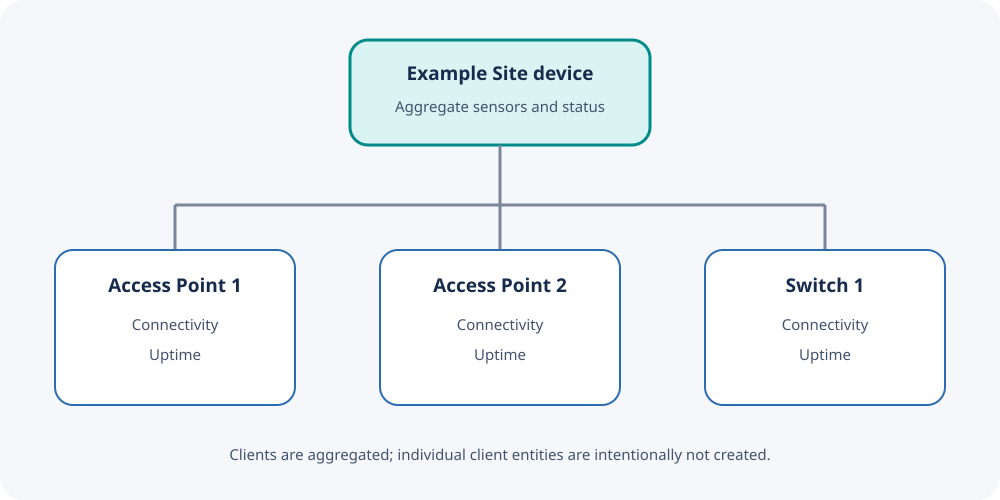

# Devices and Entities

The integration models the Instant On site as a parent device and each access
point or switch as a child infrastructure device.



## Site entities

| Category | Entities |
| --- | --- |
| Infrastructure | Total devices, devices online, APs online, switches online |
| Clients | Wireless clients, wired clients |
| Networks | Wireless networks |
| Alerts | Major, minor, and informational alerts |
| Live traffic | Download and upload throughput |
| Transfer totals | Downloaded and uploaded in 24 hours |
| Radios | 2.4, 5, and 6 GHz client counts |
| Signal | Average signal, average SNR, poor-signal clients |
| Power | Aggregate PoE power |
| Maintenance | Devices needing firmware |

Exact entity IDs are generated from the site name and can be customized in
Home Assistant. Dashboard examples use IDs such as:

```text
sensor.example_site_wireless_clients
sensor.example_site_download_throughput
sensor.example_site_poe_power
```

## Access-point and switch entities

Every discovered infrastructure device receives:

- A connectivity binary sensor
- An uptime sensor
- Device metadata such as manufacturer, model, and firmware where available
- A relationship to the parent site device

## Client classification

Current portal responses can mix wired and wireless records in the same client
summary. The integration classifies records using their client type. The older
wired-client endpoint is used only as a compatibility fallback.

Individual clients do not become Home Assistant entities. This avoids entity
registry churn and reduces exposure of client names and identifiers.

## Unknown and unavailable values

An individual sensor may be unknown when:

- The site or account does not expose that optional API endpoint.
- The portal response omits the relevant field.
- The portal has not calculated the metric yet.

An unavailable integration entry usually indicates authentication, connectivity,
or required-endpoint failure. See [Troubleshooting](Troubleshooting.md).

## Units and history

Throughput sensors represent a current rate; 24-hour transfer sensors represent
an accumulated quantity. PoE power represents the aggregate value reported by
Instant On. Home Assistant Recorder must retain an entity for its history graph
to show meaningful data.

