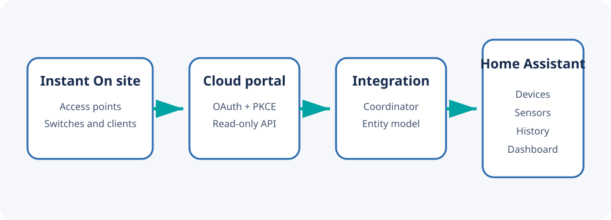

# Aruba Instant On for Home Assistant

Welcome to the detailed guide for the Aruba Instant On custom integration.
It monitors cloud-managed Instant On sites and presents their health, clients,
traffic, radios, PoE load, alerts, and firmware state in Home Assistant.

## Start here

1. [Choose an installation method](Installation.md).
2. [Prepare a dedicated Instant On account](Account-and-Site-ID.md).
3. [Add and configure the integration](Configuration.md).
4. [Understand the devices and entities it creates](Entities.md).
5. [Build the example network dashboard](Dashboard.md).

For upgrades, authentication failures, unavailable sensors, or portal API
changes, see [Troubleshooting](Troubleshooting.md).

## What this integration does

- Reads site, inventory, client, network, alert, application-usage, radio,
  PoE, uptime, and firmware information.
- Authenticates through the same cloud service used by the Instant On portal.
- Refreshes data through Home Assistant's coordinator framework.
- Creates one Home Assistant device for the site and one for each access point
  or switch.
- Exposes aggregate client data without creating entities for individual
  client devices.

## What it does not do

- It does not configure SSIDs, VLANs, switches, or access points.
- It does not reboot equipment, control PoE ports, or block clients.
- It does not communicate with local Instant AP controllers.
- It does not use the officially documented Aruba Central API.

The integration is intentionally read-only. The cloud API used by the Instant
On web portal is private and may change without notice.

## Compatibility at a glance

| Component | Requirement |
| --- | --- |
| Home Assistant | A current supported release |
| Aruba platform | Cloud-managed Aruba Instant On |
| Account | Dedicated portal account with site access |
| MFA | Not currently supported by the automated portal flow |
| Polling | 60–3600 seconds; 300 seconds recommended |

## Privacy

Never post credentials, tokens, cookies, site IDs, serial numbers, MAC
addresses, IP addresses, SSIDs, client lists, or unredacted diagnostics.
Repository examples use fictional names by design.
