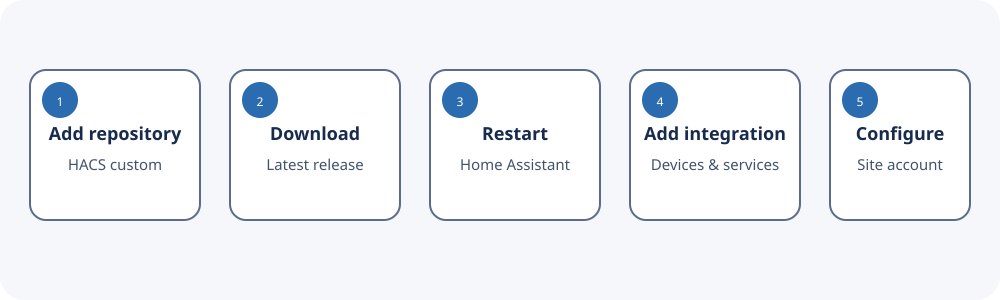

# Installation

HACS is recommended because it provides version discovery and upgrades. Manual
installation is useful for development or when HACS is unavailable.

## HACS custom repository

1. Open **HACS → Integrations**.
2. Open the three-dot menu and choose **Custom repositories**.
3. Enter:

   ```text
   https://github.com/turbogizzmo/ArubaInstantOnPortalHA
   ```

4. Select **Integration** as the category and add the repository.
5. Search for **Aruba Instant On** and select **Download**.
6. Restart Home Assistant when HACS asks.
7. Continue with [Account and Site Selection](Account-and-Site-ID.md).



## Manual installation

Copy the integration directory into the Home Assistant configuration:

```text
/config/
└── custom_components/
    └── aruba_instant_on/
        ├── __init__.py
        ├── manifest.json
        ├── config_flow.py
        └── ...
```

The final path must be:

```text
/config/custom_components/aruba_instant_on/manifest.json
```

Restart Home Assistant after copying or replacing the files.

## Confirm Home Assistant loaded it

Open **Settings → Devices & services → Add integration** and search for
**Aruba Instant On**.

If it is absent:

1. Confirm the directory is not nested twice.
2. Confirm `manifest.json` is directly inside `aruba_instant_on`.
3. Restart Home Assistant, not only the browser.
4. Refresh the browser cache.
5. Check **Settings → System → Logs** for `aruba_instant_on`.

## Upgrading

With HACS, install the offered update and restart Home Assistant. For a manual
installation, replace the entire `aruba_instant_on` directory with the new
release, then restart.

Do not mix files from different releases. Home Assistant may retain imported
Python modules until the next full restart.

## Removing

1. Open **Settings → Devices & services**.
2. Select **Aruba Instant On**.
3. Open the integration menu and choose **Delete**.
4. If installed through HACS, remove it from HACS separately.
5. Restart before manually deleting its custom-component directory.
