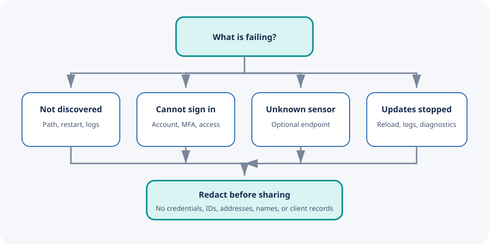

# Troubleshooting

## Decision path

## Integration does not appear

- Confirm the component path ends with
  `custom_components/aruba_instant_on/manifest.json`.
- Restart Home Assistant after installation.
- Clear the browser cache.
- Check Home Assistant logs for manifest or import errors.

## Authentication failed

- Test the dedicated account in the Instant On web portal.
- Confirm the password has not expired or changed.
- Confirm the account does not require MFA.
- Confirm it can access the intended site.
- Avoid repeatedly retrying at a short interval.

## No sites are available

- Confirm the dedicated account can see at least one site in the portal.
- If all accessible sites are already configured, add another config entry
  only after granting the account access to another site.
- Reload the integration after changing site permissions in the portal.

## Some sensors are unknown

Optional portal endpoints are not uniformly available. A missing optional
endpoint does not fail the integration. Compare the unknown entity against the
entity table and confirm whether the portal itself displays that metric.

## All entities stopped updating

1. Open the integration entry and choose **Reload**.
2. Check whether the Instant On portal is available.
3. Review Home Assistant logs.
4. Temporarily enable debug logging.
5. Reproduce one failed refresh.
6. Disable debug logging.
7. Download diagnostics.

Do not leave debug logging enabled longer than necessary.

## Safe diagnostics

Before sharing anything, remove:

- Credentials, tokens, cookies, and authorization headers
- Account or personal names
- Site IDs and Home Assistant registry IDs
- Serial numbers and MAC or IP addresses
- SSIDs, hostnames, and client records

Open a private security advisory—not a public issue—if redaction is uncertain
or the report concerns credential handling.

## Portal API changed

Because the portal API is private, a portal release can break authentication or
response parsing. Include the Home Assistant version, integration version,
failure stage, and a minimal redacted log excerpt in a bug report.
